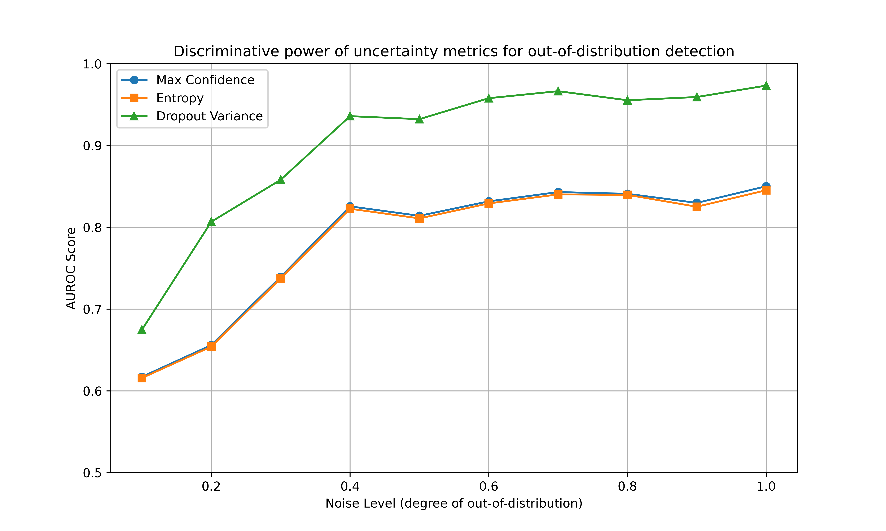

## Motivation
Quick check to confirm that MC dropout MLP is better suited to model epistemic uncertainty than a standard MLP.

## Setup
We are interested in detection of out-of-distribution (OOD) data points after model training, without explicitly training on that task. As such, we treat it as an uncertainty estimation problem.

To that end, we train an MLP with a relatively high dropout rate on the digits dataset.
The test/eval dataset comprises some images corrupted with salt-and-pepper noise. We interpret the amount of noise per corrupted image as proxy of OOD-ness. 

We then evaluate the AUROC of classifying test samples as in-distribution/OOD across the following signals:
- Standard MLP: 1 - max confidence
- Standard MLP: entropy across logits
- MC Dropout MLP: variance between MC inference passes

## Results
- detection of corrupted samples gets easier with increasing noise level.
- entropy- and max confidence performs highly similarly on our data, across the entire range of noise
- variance across MC dropout inference consistently achieves substantially higher AUROC on the task than entropy and max confidence.

## Discussion
MC dropout has been shown to be a Bayesian approximation, making it particularly suitable for tasks involving epistemic uncertainty (Gal & Ghahramani, 2016), though there has been some criticism of the approach (Le Folgoc et al., 2021).

Our empirical findings align with the expectation that MC dropout outperforms standard approaches on tasks involving epistemic uncertainty.

