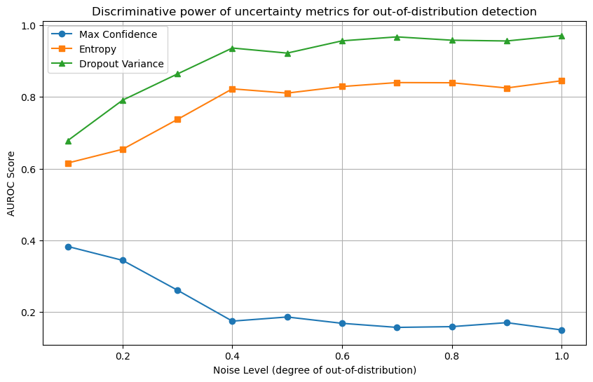

**Motivation**: quick check if MC dropout MLP is better suited to model epistemic uncertainty than a standard MLP.

**Setup**: identifying out-of-distribution samples in test data. (MNIST corrupted with increasing amounts of salt-and-pepper noise - noise as proxy for degree of OOD-ness)

We evaluate the AUROC on the OOD detection task across the following approaches:
- Standard MLP: max confidence
- Standard MLP: entropy across original training set classes
- MC Dropout MLP: variance between MC inference passes

**Results:**\
MC Dropout MLP achieves highest AUROC, but entropy is also relatively high. Max confidence is useless, especially with increasing OOD-ness.

